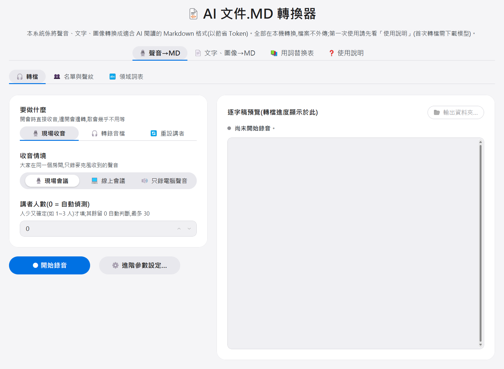
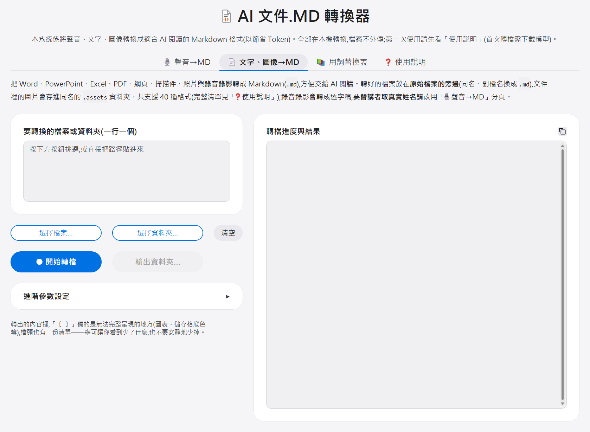

# AI 文件.MD 轉換器 使用手冊

把**聲音、文字、圖像**都轉換成**適合 AI 閱讀的 Markdown 格式**(以節省 Token):會議錄音或錄影變成「**誰說了什麼**」的**繁體中文逐字稿**,Word、PowerPoint、Excel、PDF、掃描件等文件轉成 Markdown。所有處理都在本機電腦完成,**錄音檔、文件和逐字稿都不會上傳到任何地方**。(只有兩種情況會連網:第一次使用時下載 AI 模型、以及轉**舊版** Office 檔而電腦上沒有 LibreOffice 時下載它——舊版指副檔名**結尾沒有 x** 的 `doc`/`xls`/`ppt`,現在的 `docx`/`xlsx`/`pptx` 不會下載任何東西。)

⚠️ **只能在 Windows 10/11(x64)上使用,macOS 與 Linux 都不能安裝**(原因見第五章「系統需求」)。

📥 **下載(免費):[最新版 scribe2md.zip](https://github.com/VincentLiang1/scribe2md/releases/latest)** —— 點進去,在頁面下方的 `Assets` 區塊點 `scribe2md.zip`。**檔案不到 1MB 是正常的**,執行環境與 AI 模型都是安裝時才自動下載(合計約 3～6GB,見第五章)。

> 有問題先看第四章「常見問題與故障排除」;還是解決不了,就聯絡把這個工具給你的人,或到專案的 GitHub 頁面[開一個 issue](https://github.com/VincentLiang1/scribe2md/issues)。

---

## 快速上手(3 分鐘版)

趕時間先看這段就夠了,細節在後面各章。

**第一次安裝(只做一次,約 10 分鐘):**

1. 解壓縮 zip 到桌面,或 `C:\` 下的資料夾(例如 `C:\Tools`;**資料夾名稱用中文也可以**)
2. 雙擊 **`安裝.bat`**——若跳出藍色「Windows 已保護您的電腦」,點「其他資訊」→「仍要執行」(這是正常的);黑色視窗自動安裝 3～10 分鐘,看到 `環境建置完成` 就是成功。裝完會**在桌面放上「AI 文件.MD 轉換器」的圖示**(「開始功能表」裡也有一份),以後從那裡啟動就好
3. 雙擊桌面上的「**AI 文件.MD 轉換器**」(或工具資料夾裡的 **`啟動.bat`**)——瀏覽器會自動開啟工具頁面;**黑色視窗要保持開著**(關掉工具就停了)

**日常使用:**

1. 雙擊桌面上的「AI 文件.MD 轉換器」(沒有那顆圖示就雙擊工具資料夾裡的 `啟動.bat`,兩者完全一樣)
2. 開啟時「要做什麼」預設就是「**🎙️ 現場收音**」——選好收音情境,按「● 開始錄音」就能**邊開會邊錄邊轉**(會議結束只等收尾,不用整場重轉),詳見工具裡「❓ 使用說明」的「**🎙️ 開會時直接錄音**」
3. 要轉**已經錄好的檔案**:把「要做什麼」切到「**🎧 轉錄音檔**」,按「**選擇檔案…**」挑選錄音(`m4a`/`mp3`/`wav`)或錄影(`mp4`/`mov`/`avi`)——也可以直接把檔案路徑貼進輸入框(iPhone 語音備忘錄的檔案就是 `m4a`,直接可用;**不用上傳**,工具直接讀電腦裡的原檔),按「開始轉檔」(選好檔案後按鈕才會亮起),等進度跑完。**選 1 個檔案**才會讓你替講者命名;**選多個檔案或整個資料夾**是整批連續轉、不做命名,詳見工具裡「❓ 使用說明」的「**🎧 轉現成的錄音、錄影**」
4. 「講者人數」就在左欄主畫面上:**1~3 人的訪談或對談請填確切人數**,其餘(尤其十幾人的會議)留 **0** 讓它自動判斷。模型與 CPU 核心數都收在「**進階參數設定**」裡,用**預設值**就好
5. 下載逐字稿(`.md` 檔;**排版好的樣子看網頁右側的預覽區**,用記事本或 Word 打開只會看到 `##`、`**` 這些原始符號——Word 沒有開啟 Markdown 的功能),檔案也自動存在工具資料夾的 `output` 裡
6. 要把**文件**(Word/PowerPoint/Excel/PDF/網頁)轉成 Markdown 給 AI 讀:切到「**📄 文字、圖像→MD**」分頁,選檔案或整個資料夾,按「開始轉檔」——轉好的 `.md` 就放在原始文件旁邊,詳見工具裡「❓ 使用說明」的「**📄 文件、圖片轉成 md**」
7. 用完關掉黑色視窗即可

**轉到一半不想轉了?** 按「停止」,按鈕會立刻變成「停止中…」,等目前片段收尾後停下——一般幾十秒內,若正在載入模型(進度條剛起步時)可能要一兩分鐘,按一次就好、不用重按(按過就會鎖住)。轉到一半的檔案直接放棄、不留半成品,路徑欄也會清空——要轉別的檔案,重新選檔即可。直接關黑色視窗也可以(不會弄壞任何東西),殘留的暫存檔會在下次啟動時自動清掉。

**轉檔中不小心關到瀏覽器分頁?** 會先跳出確認視窗擋一下(訊息文字是瀏覽器內建的,例如「離開網站?」),按「取消」就能繼續轉。沒在轉檔時關閉分頁則不會多問。

**第一次轉檔特別注意:** 第一次按「開始轉檔」會先自動下載 AI 模型(約 2～3GB,同一個模型只下載一次)。網頁進度條會停在「轉錄與講者分析」不太動——**這不是當機**,下載進度在黑色視窗裡,約 10～30 分鐘,請耐心等待。

---

## 一、第一次安裝(只需做一次,約 10 分鐘)

### 事前確認

- 一般的 Windows 10/11 電腦即可,不需要另外安裝任何軟體
- 需要網路(安裝環境與第一次下載 AI 模型會用到)

### 步驟 1:解壓縮

對 zip 檔按右鍵 →「全部解壓縮」。解壓後會得到一個 `scribe2md` 資料夾,裡面有 `安裝.bat`、`啟動.bat`、這份使用手冊(`README.md`)和一些程式檔案。

放哪裡都可以,**資料夾名稱是中文也沒關係**(工具在中文路徑下實測過:安裝、文件轉檔、逐字稿都正常)。只有一個建議:**放淺一點**——桌面或 `C:\` 底下(例如 `C:\Tools`)就好,別塞進層層巢狀的深資料夾裡,那會讓路徑長到接近 Windows 的長度上限,轉檔時比較容易出狀況。

### 步驟 2:執行 安裝.bat

雙擊 **`安裝.bat`**。

- **如果跳出藍色的「Windows 已保護您的電腦」視窗:這是正常的**(Windows 對來路是網路的批次檔一律警告)。點 **「其他資訊」**,再點 **「仍要執行」** 即可。
- 接著會出現一個**黑色文字視窗**,自動安裝執行環境,約需 3～10 分鐘(視網路速度)。
- 看到 **`環境建置完成`** 字樣就是成功了,按任意鍵關閉視窗。
- 如果看到 `[錯誤]`,先重跑一次;仍失敗請看第四章。

### 步驟 3:執行 啟動.bat

雙擊 **`啟動.bat`**。

- 一樣會出現黑色文字視窗,幾秒後**瀏覽器會自動打開工具頁面**。
- **黑色視窗請保持開著**——它就是工具本體,關掉它工具就停了。
- 瀏覽器如果沒有自動打開,自己開瀏覽器,在網址列輸入 `127.0.0.1:7860`(**以黑色視窗顯示的網址為準**——若 7860 被占用,工具會自動改用下一個號碼)。

之後每次要用,只要雙擊 `啟動.bat` 這一個動作。

---

## 二、日常使用

### 頁面上有哪些分頁

| 分頁 | 做什麼 |
| --- | --- |
| 🎙️ 聲音→MD | 會議錄音/錄影或現場收音 → 逐字稿。裡面再分三個子分頁:「**🎧 轉檔**」(平常都在這裡)、「**👥 名單與聲紋**」(講者命名要用的與會人員名單、已記住的聲紋)和「**🔤 領域詞表**」(讓轉錄少打錯專有名詞) |
| 📄 文字、圖像→MD | Word / PowerPoint / Excel / PDF / 網頁 / 掃描件 / 照片 / 郵件 → Markdown |
| 📚 用詞替換表 | 把偶發的大陸用詞換成台灣用詞(軟件→軟體) |
| ❓ 使用說明 | **每一個功能的完整說明**,依「你現在想做什麼」分成十篇 |

雙擊 `啟動.bat`,等瀏覽器開啟工具頁面。開啟時「要做什麼」預設是「**🎙️ 現場收音**」(用法與好處見使用說明的「🎙️ 開會時直接錄音」);要轉已經錄好的檔案,把「要做什麼」切到「**🎧 轉錄音檔**」(見使用說明的「🎧 轉現成的錄音、錄影」)。

### 📋 功能一覽

**這裡只列出「有哪些功能」,讓你知道它做得到什麼;每一項的詳細說明請看工具裡的「❓ 使用說明」分頁**(左邊目錄的分類與下面完全一樣,點進去就是那一篇)。

**🚀 開始之前**

- 第一次轉檔會自動下載 AI 模型(約 2～3GB,僅此一次)
- 成品固定是 `.md`(對話式逐字稿、自動加標點)
- 深色/淺色外觀切換(頁面右上角齒輪,會記住)
- 全部在本機處理,檔案不外傳
- 你的東西(逐字稿在 `output`、聲紋名單詞表在 `data`)都在工具資料夾裡,複製即備份

**🎙️ 開會時直接錄音(現場收音)**

- 三種收音情境:現場會議、線上會議(**回音自動剔除**,喇叭外放不必戴耳機)、只錄電腦聲音;**每次開啟都從「現場會議」開始**
- 邊開會邊轉逐字稿,散會幾乎不用等;有顯示晶片時連講者分離也在錄音期間做掉
- 錄音檔也是成品(`錄音_日期_時間.wav`;線上會議是雙聲道:左=現場、右=電腦)
- 誤關瀏覽器不會中斷錄音;錄音期間電腦不會自動睡眠
- 「講者人數」錄音中隨時可改

**🎧 轉現成的錄音、錄影**

- 選檔案(可多選)、選整個資料夾,或直接貼路徑——**不用上傳**
- 選 1 個檔案 → 轉完可替講者命名;選多檔或資料夾 → 整批連轉、不命名
- 「包含子資料夾」可選(預設不含)
- 轉檔中可隨時停止,已完成的檔案保留;失敗時路徑保留可直接重試

**👥 替講者取名字**

- 自動辨識已登記過的人並**預填名字**,下次開會越用越準
- 每欄附「發言段數 + 最長一句摘錄」,並可「▶ 試聽」該講者的原音
- 同一場會議一個名字只給一位講者;不夠確定就**留白不猜**
- 逐字稿尾端附「**講者辨識診斷**」,點出最建議人工核對的標籤
- 「**🔍 核對**」:把某一位的發言接起來一次聽完,聽出混進來的段落可當場改掛給別人(現場收音、轉檔、重設講者三條路都有)
- 「未知」欄只改逐字稿文字、不登記聲紋
- 與會人員名稱維護、聲紋單筆刪除/全部清除
- **聲紋健檢**:找出某個名字底下混到別人的聲紋;名單與聲紋庫對不上時也會主動提醒
- 命名進度會存到本機,斷線、關瀏覽器、隔天再開都能接續
- **重設講者**:事後補命名或改掉打錯的名字,不會重轉

**📄 文件、圖片轉成 md**

- 支援 Office(含舊版與巨集)、OpenDocument、PDF、圖片、csv/txt/rtf、網頁與電子書、Visio、Outlook 郵件、錄音錄影
- **圖片裡的文字自動辨識(OCR)**,連文件內嵌的圖也會
- 簡體自動轉繁體、超連結保留網址、Word 註腳收在文末、照片附拍攝資訊
- 郵件附件遞迴轉換(信中信最多 3 層)
- 轉不出來的地方留「〔 〕」標記並在檔頭彙總,**絕不安靜地丟掉**
- 已經有同名 `.md` 就跳過,同一個資料夾可以放心重跑
- 轉好的檔案放在原始文件旁邊;可一鍵「輸出資料夾…」直接跳到位置

**🤖 把成品交給 AI**

- 貼給 AI 之前先關掉「拿對話內容訓練模型」的設定(附設定截圖)

**⚙️ 調準確度與速度**

- 模型「快速 / 精準」(依有沒有顯示晶片自動選好)
- 講者人數(留 0 自動偵測)
- **領域詞表**:讓專有名詞少打錯
- **用詞替換表**:大陸用詞換成台灣用詞(逐字稿與文件轉檔都會套用)
- CPU 核心數;轉檔期間自動退到背景優先權,電腦照常能用

**⚡ 自動化與批次處理**

- `doc2md` 命令列入口,不開網頁介面(**全部參數**見該節的表格)
- `安裝Skill.bat`:讓 Claude Code 這類 AI 工具自己叫用轉檔
- `audit_voiceprints.py`:聲紋庫的完整體檢(比網頁上的「健檢」更詳細)

**🆘 好像怪怪的**

- 斷線後的「重新連線」提示、CPU 99% 是正常的、資料夾視窗只在工作列閃爍、錄音資料不連續、轉檔失敗怎麼重試、想重轉要先刪舊的 `.md`、回報問題時要附哪個紀錄檔

**💡 這個工具的由來**

- 這個工具當初解決的是什麼問題、後來怎麼一路長成現在的樣子,以及做出來之後看見的事(唯一不講操作的一篇)

### 細節在哪裡

上面每一項的**完整說明**都在工具裡的「**❓ 使用說明**」分頁——啟動 `啟動.bat` 之後就在頁面上,左邊目錄的分類與上面的功能一覽完全一樣,點哪一篇看哪一篇。

**為什麼細節不寫在這裡**:同一份說明維護兩份,遲早會有一邊過時,而使用者看到的是哪一邊全憑運氣。工具裡那份離操作最近(旁邊就是按鈕),所以細節統一放那裡;這份 README 負責的是「**還沒啟動程式**時要知道的事」——怎麼安裝、有哪些功能、出問題怎麼辦。

> 只想用**命令列**、不開網頁介面?`uv run doc2md --help` 會印出全部參數;完整說明在使用說明的「⚡ 自動化與批次處理」那一篇。
---

## 三、怎麼把錄音拿進電腦

- **iPhone 語音備忘錄**:打開「語音備忘錄」→ 點該錄音 → 分享(往上箭頭圖示)→ 用**郵件寄給自己**、傳到 **LINE/Teams 的「自己」聊天室**、或存到 **OneDrive**,再從電腦下載。拿到的就是 `.m4a` 檔,用「選擇檔案…」挑它即可。
- **Teams 會議錄影**:會議結束後,錄影會出現在該會議的聊天記錄裡 → 點錄影 → 右上角「…」→ **下載**,拿到 `.mp4` 檔。

---

## 四、常見問題與故障排除

**Q:雙擊 .bat 跳出藍色「Windows 已保護您的電腦」?** 正常現象。點「其他資訊」→「仍要執行」。

**Q:找不到「開始轉檔」按鈕/按鈕灰灰的、按不下去?** 整顆按鈕沒出現,是「要做什麼」停在「現場收音」(開啟時的預設)——切到「**🎧 轉錄音檔**」按鈕就會出現。按鈕在但灰灰的,是還沒選檔案(或剛轉完一個檔案,路徑欄已自動清空、等待下一個),按「選擇檔案…」挑好檔案,按鈕就會亮起。

**Q:按了開始之後,進度停在「轉錄與講者分析」很久都不動?** 如果是**第一次轉檔**(或第一次改用「精準」模型),是在下載 AI 模型(約 2～3GB),看黑色視窗會有下載進度,等它跑完即可(10～30 分鐘)。不是第一次的話,長錄音本來就需要時間——1 小時會議約 20～40 分鐘,黑色視窗有活動就是正常。

**Q:轉檔失敗,訊息說「模型下載失敗,請確認網路連線後重試」?** 第一次使用(或第一次改用「精準」模型)需要網路下載 AI 模型,這個訊息表示下載沒有成功。確認網路正常後再按一次「開始轉檔」即可——下載支援續傳,不會從頭來過。在公司或學校的網路上一直失敗,可能是防火牆/代理伺服器擋了下載,換一個網路環境(家用網路、手機熱點)通常就會過;仍不行請聯絡把工具給你的人。

**Q:訊息說「不信任下載網站的安全憑證」,或黑色視窗出現一長串 `CERTIFICATE_VERIFY_FAILED`?** 這台電腦驗不過下載網站的憑證,所以 AI 模型下載不下來——**網路本身是好的**(同一個網址用瀏覽器開得起來),檢查網路不會有結果。公司網路做連線檢查、或 Windows 的根憑證沒補齊時最常見;工具會自動試兩種辦法,仍失敗請把這句話轉給貴單位的 IT:需要把公司的根憑證匯入 Windows 的「**受信任的根憑證授權單位**」。另一條路是請已經用得動的同事,把他電腦上的模型資料夾(`%LOCALAPPDATA%\meeting-scribe\models`)整個複製過來、貼到你電腦的同一個位置,模型就地可用、不必再下載。順帶一提,**重設講者時明明有錄音檔卻沒有試聽按鈕**,也是同一件事(抽聲紋的模型下載不下來,那次只剩手動命名)。要把細節提供給把工具給你的人:在工具資料夾的網址列輸入 `cmd` 後執行 `uv run python scripts\diagnose_tls.py`,把整段輸出複製給他即可(這支只做檢查,不會下載也不會改設定)。

**Q:瀏覽器沒有自動打開?** 自己開瀏覽器,輸入黑色視窗裡顯示的網址(通常是 `127.0.0.1:7860`;號碼被其他程式占用時會自動遞增)。如果打不開,確認黑色視窗還開著、沒有錯誤訊息。

**Q:啟動.bat 跑出一串英文,說 `startup-events failed (code 403)`?** 這台電腦有東西把「連自己」也擋掉了,通常是**公司的代理伺服器(Proxy)**或資安軟體——工具只在你自己的電腦上跑、不會連到外面,但那些設定把 `127.0.0.1` 也一起攔了。工具已經會自動處理最常見的那一種(Windows 內容設定裡的代理);仍然出現這個訊息,就是自動處理不了的類型,請把這句話轉給貴單位的 IT:**「請把 `localhost` 與 `127.0.0.1` 加進代理伺服器的例外清單(以及防火牆的本機連線白名單)。」** 這不會放寬任何對外的管制,只是讓程式連得到自己。

**Q:安裝.bat 顯示 [錯誤]?**
1. 先確認網路正常,重跑一次(重跑不會從頭來過,已完成的部分會保留)。
2. 若在公司或學校的網路且一直失敗,可能是防火牆/代理伺服器擋了下載,換一個網路環境(家用網路、手機熱點)通常就會過;仍不行請聯絡把工具給你的人。

**Q:防毒軟體跳出警告或隔離檔案?** 本工具全部元件皆為開源軟體,無惡意行為(原始碼公開,可自行檢視)。把工具資料夾加入防毒軟體的白名單即可;在沒有權限自行調整的電腦上(例如公司配發的機器),請聯絡貴單位的 IT。

**Q:逐字稿裡出現「(此段轉錄異常……請對照原始錄音)」是什麼意思?** AI 轉錄模型遇到多人同時說話、雜訊大或長段連續發言時,偶爾會「跳針」——開始無限重複同一個詞(例如「包括資料,包括資料,……」),那段的真實內容就轉不出來。工具會自動偵測並重試搶救;仍救不回來的段落,就以這個標記誠實告訴你「這段不可信」,並附上時間範圍,方便你直接去原始錄音聽那一段。這通常只影響單一段落,其餘逐字稿不受影響。

**Q:會不會把我的錄音傳出去?** 不會。工具頁面只有你自己的電腦能開(綁定 127.0.0.1)、對外遙測全部關閉,唯一的網路行為是第一次下載模型與執行環境——模型下載完成後,之後每次轉檔**完全不連網**(拔網路線也能用)。錄音與逐字稿從頭到尾都在你的電腦裡。

**Q:轉檔的檔案會留在電腦的暫存區嗎?** 轉檔過程會在系統暫存區產生工作副本(轉檔中間檔、供瀏覽器預覽/下載的副本),**正常關閉工具時當場清掉;直接關黑視窗或當機留下的殘檔,下次啟動工具時也會自動清掉**——不會越積越多。你的**原始檔案完全不受影響**(工具只讀取,不會搬動或刪除原檔)。成品逐字稿與錄音檔則永久保存在 `output` 資料夾,不算暫存。

**Q:第一次總共要下載多少東西?** 執行環境數百 MB(安裝.bat)+ AI 模型約 2～3GB + 標點模型約 60MB + 轉檔工具約 50MB(第一次轉檔時)。每一項都只下載一次。「快速」和「精準」各用一個模型,第一次用到哪個才下載哪個——都用過的話,模型合計約 4～6GB。

**Q:速度多快?** 較新的電腦(例如 Intel Core Ultra 7 + Arc 內建顯示晶片)會自動用內建 GPU 加速轉錄,同時用 CPU 做講者分析——兩件事並行,不互相等待。沒有可用顯示晶片的電腦上,兩個步驟會改為依序執行(避免互搶處理器),速度較慢屬正常。快速模型下 1 小時會議粗估 20～40 分鐘。**在有 GPU 的電腦上,「精準」和「快速」的總時間其實差不多**——因為講者分析(CPU)才是瓶頸、又和轉錄並行,精準多花的轉錄時間被藏在裡面(所以這類機器預設就用精準);只有在沒 GPU 的電腦上,精準才會明顯慢約 4 倍。處理時間大約和錄音**長度**成正比(例如 3 小時錄音約 1～2 小時),和檔案大小(MB 數)無關——幾百 MB 的大檔案不用擔心。處理期間可以把視窗放著,先去做別的事。想知道你的電腦有沒有被偵測到 GPU,打開左欄下方的「**進階參數設定**」,「模型」下面就寫著(「電腦偵測到 GPU…」或「電腦沒有偵測到 GPU…」);想知道是**哪一種**(Intel GPU / NVIDIA GPU / CPU),看「❓ 使用說明」→「⚙️ 調準確度與速度」那篇的「本機偵測結果」。完成後逐字稿預覽開頭也會標示這一份實際使用的裝置。另外:一口氣講很久、完全沒有停頓的段落,進度條會停在原地一陣子再一次前進一大段——黑色視窗有活動就是正常,不是當機。

一個已知例外要特別注意:**部分老舊電腦的內建顯示晶片(例如 Intel UHD 600 系列)也會被工具自動當成加速晶片,但它們太弱,實際可能比純 CPU 還慢——而且工具不會自動發現「太慢」而換回 CPU**。判斷方式:「❓ 使用說明」→「⚙️ 調準確度與速度」那篇的「本機偵測結果」寫著「Intel GPU」(轉完一份之後,逐字稿預覽開頭也會標),而且黑色視窗有活動、也不是在下載模型,但速度明顯不合理地慢。較新的機器不受影響;在老舊電腦上遇到這種情況,請聯絡把工具給你的人,或到 GitHub 開 issue 回報。

**Q:可以把工具拿到別台電腦用嗎?** 可以。把 zip 複製到另一台電腦,照第一章的三個步驟(解壓 → `安裝.bat` → `啟動.bat`)重新安裝一次即可,不需要改任何東西。三件事要知道:

1. **每台電腦都要重新下載一次模型**:AI 模型存在「每台電腦、每個 Windows 使用者帳號」自己的使用者目錄裡,**不在工具資料夾裡**——所以複製工具資料夾過去並不會把模型帶過去,新電腦第一次轉檔會再自動下載約 2～3GB(同一台電腦換不同帳號登入,也一樣要各自下載)。
2. **系統需求相同**:Windows 10/11(x64)、記憶體 8GB 以上、硬碟約 8GB、第一次安裝與下載模型需要網路。**新的那台也必須是 Windows 10/11——macOS 與 Linux 都不能用**,原因見第五章。
3. **速度依機器差很多**:沒有顯示晶片的舊電腦一樣能用,只是比較慢;速度預期與老舊內建顯示晶片的特別注意事項,見上面「速度多快?」那一題。

**Q:講者分得不準?** 先看是哪一種場合,兩種的做法**正好相反**:

- **1~3 人的訪談或對談** → 在「講者人數」填**確切人數**。這正是自動判斷最不擅長的規模:實測過一場兩個人、95 分鐘的對談留 0 去跑,被切成 16 位講者。人少又數得清的時候,填了會穩定得多。
- **十幾人以上的會議** → **留 0 讓它自動判斷,不要硬填**。人一多其實數不清,而且實測過同一場 20 多人的月會:自動判斷能把四個遠端據點的人分開,填 18/22/25/30 反而每一種都把他們併成同一位——指定人數時,那些名額會被幾秒鐘的雜訊碎段佔走。
- **中間的人數** → 留 0 就好;確定人數的話填了也可以。

留 0 時工具會保留發言量足夠、且聲音與他人明顯不同的講者,只把「極短的雜訊碎段」和「同一人音量/距離變化造成的漂移」併掉。收音品質(離麥克風距離、環境噪音)同樣直接影響結果,而且比參數更關鍵。另外,逐字稿最後面有一段「講者辨識診斷」會列出每個標籤的發言輪次、時長與一致性,並點名最該優先核對的幾位——要判斷這一份分得準不準,看那裡比重聽整份快得多。

**Q:怎麼更新新版本?** 到 [Releases 頁面](https://github.com/VincentLiang1/scribe2md/releases/latest)下載最新的 `scribe2md.zip`(那個網址永遠指向最新版,不必挑),解壓縮、**覆蓋**到你現在的工具資料夾(檔案總管問「要取代嗎」就選取代),再雙擊一次 `安裝.bat` 就好。跟第一次安裝是同一個 zip,不必挑版本。

**你原本的東西都會留著**:`output` 裡的逐字稿、`data` 裡的聲紋與名單詞表,以及已經下載好的 AI 模型(它存在 `%LOCALAPPDATA%\meeting-scribe\models`,不在工具資料夾裡,更新動不到它)。工具資料夾裡的 `data-default` 是出廠預設,只有在 `data` 缺東西時才會被拿去補,平常不會動到你的資料。

還是想更保險的話,更新前先把 `data` 資料夾複製一份到別的地方,兩分鐘的事。

**Q:硬碟空間不夠,想清掉模型?** 刪除 `%LOCALAPPDATA%\meeting-scribe\models` 資料夾即可(在檔案總管網址列貼上這串路徑就能開)。下次使用會重新下載。

**Q:遇到問題要回報,需要提供什麼?** 工具資料夾裡的 `logs` 子資料夾,每次啟動都會存一份當次的紀錄檔(檔名就是啟動時間,例如 `2026-08-03_143020.log`);黑色視窗開頭也會印出這次的檔案路徑。**回報問題時把那個檔案一併附上**(給把工具給你的人,或到 GitHub 開 issue),裡面有黑色視窗看得到的訊息,還有一些額外的診斷數據(例如錄音期間收音是否穩定)——比口頭描述有用得多。紀錄檔開頭就寫著「**程式版本**」那一行,附上檔案就有了——沒有它,沒人知道你裝的是哪一版。紀錄檔只留在自己電腦上,不會傳到任何地方,超過 30 天的會自動刪掉。

---

## 五、系統需求

- **Windows 10/11(x64)。macOS 與 Linux 都不能用**(原因見下方)
- 記憶體 8GB 以上(建議 16GB;32GB 綽綽有餘)
- 硬碟空間:約 8GB(執行環境 + 模型;若「快速」「精準」兩種模型都下載,再多抓 2～3GB)。若要轉**舊版** Office 檔(副檔名**結尾沒有 x** 的 `doc`/`ppt`/`xls`;`docx`/`pptx`/`xlsx` 不需要)且電腦上沒有 LibreOffice,會再多用約 1GB
- 不需要預先安裝 Python、ffmpeg 或任何軟體,安裝程序全自動處理

**為什麼只能在 Windows 上跑?** 不是「還沒做到」,而是工具有幾件事**直接建在 Windows 專屬的功能上**,換到 macOS 或 Linux 沒有等價的東西可以替代:**錄下電腦自己播出來的聲音**(「線上會議」與「只錄電腦聲音」這兩種收音情境完全靠它)、**自動裝好並呼叫 LibreOffice** 來轉舊版 Office 檔(`doc`/`ppt`/`xls`)、**把運算壓在背景讓你轉檔時電腦還能用**,以及轉完之後**一鍵開啟成品資料夾**。安裝與啟動也是 Windows 的批次檔(`.bat`),在其他系統上根本點不動。

所以手邊只有 Mac 的話,請改用一台 Windows 電腦。在 Mac 上開 Windows 虛擬機的做法**我們沒有實際測過**,不保證裝得起來,也不建議當成正式方案。

## 六、授權

本工具以 **AGPL-3.0** 釋出,完整條款見工具資料夾裡的 `LICENSE`。白話講:你可以自由使用、複製、修改;只有在**把修改後的版本散布出去**時,才必須一併提供原始碼並沿用同一份授權。自己拿來轉檔、在公司內部使用,不受任何限制。

各元件的授權盤點:

| 元件 | 授權 |
|------|------|
| Whisper 模型(OpenAI)/ faster-whisper / CTranslate2 | MIT |
| sherpa-onnx / 3D-Speaker embedding / Gradio / OpenCC / OpenVINO | Apache-2.0 |
| FunASR CT-Transformer 標點模型(sherpa-onnx 轉檔) | Apache-2.0 |
| pyannote segmentation-3.0(ONNX 轉檔) | MIT |
| FFmpeg(經 static-ffmpeg,外部程序呼叫) | LGPL/GPL(不隨本工具散布,安裝時由你的電腦自行取得) |
| python-docx / python-pptx / openpyxl / markdownify / beautifulsoup4(文件轉 Markdown) | MIT |
| lxml / striprtf / charset-normalizer(文件轉 Markdown) | BSD |
| oletools / olefile(讀 Excel 巨集的大綱) | BSD |
| RapidOCR + PP-OCRv6 模型(圖片文字辨識) | Apache-2.0 |
| pillow-heif(HEIC 解碼;內含 libheif) | BSD-3 / LGPL(動態連結) |
| extract-msg(Outlook 郵件) | BSD-2 |
| LibreOffice(舊版 Office 格式轉換,外部程序呼叫) | MPL-2.0 |
| **PyMuPDF(PDF 解析)** | **AGPL-3.0** — 見下方說明 |

**為什麼整個工具是 AGPL:** 這不是挑出來的,是 PDF 解析用的 PyMuPDF 帶來的。AGPL 要求「散布軟體時連同原始碼一起提供」,而且**具傳染性**——散布一份用到它的作品,整個作品就必須以相容授權釋出。本工具是整包 `.py` 原始碼交付(不是編譯後的執行檔),「附原始碼」這個條件天然滿足。唯一的替代方案是改用 BSD 授權的 `pypdfium2`,代價是表格與版面的還原品質會下降,而本工具的產物主要是給 AI 閱讀、表格結構錯了整段就報廢——所以選擇留下 AGPL。
