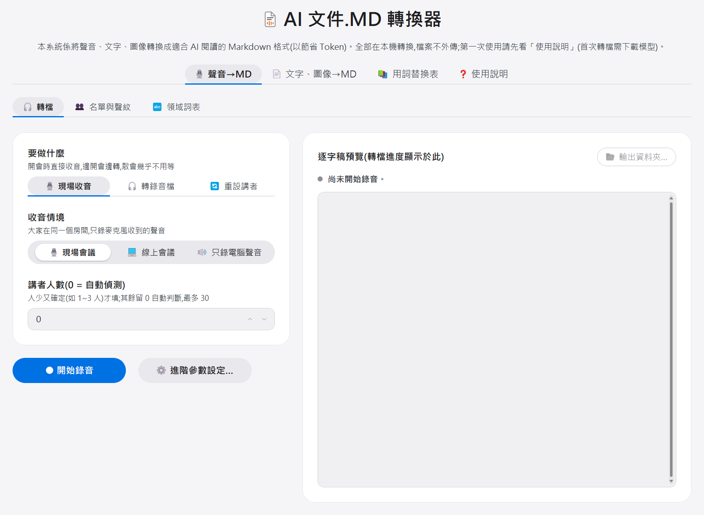
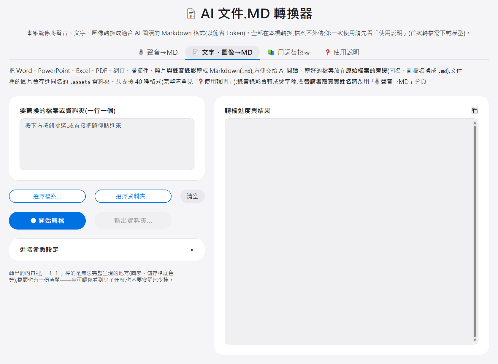

# AI 文件.MD 轉換器 使用手冊

把**聲音、文字、圖像**都轉換成**適合 AI 閱讀的 Markdown 格式**(以節省 Token):會議錄音或錄影變成「**誰說了什麼**」的**繁體中文逐字稿**,Word、PowerPoint、Excel、PDF、掃描件等文件轉成 Markdown。所有處理都在本機電腦完成,**錄音檔、文件和逐字稿都不會上傳到任何地方**。(只有三種情況會連網:第一次使用時下載 AI 模型;在 Windows 上轉**舊版** Office 檔而電腦上沒有 LibreOffice 時下載它——舊版指副檔名**結尾沒有 x** 的 `doc`/`xls`/`ppt`,現在的 `docx`/`xlsx`/`pptx` 不會下載任何東西;以及開啟時向 GitHub 問有沒有新版——只送出這一個詢問,可以關掉。)

支援 **Windows 10/11(x64)** 與 **macOS 14.2 以上的 Apple Silicon Mac**(M1 之後的機型)。⚠️ Intel 晶片的 Mac 沒有測試過、不支援;Linux 也不支援。兩個平台的差異見第五章「系統需求」。

📥 **下載(免費):[最新版](https://github.com/VincentLiang1/scribe2md/releases/latest)** —— 點進去,在頁面下方的 `Assets` 區塊挑你的平台:**Windows 點 `scribe2md-win.zip`、Mac 點 `scribe2md-mac.zip`**。檔案不大是正常的(Windows 版 2MB 出頭、Mac 版約 30MB,多的是 App 內附的 Python),執行環境與 AI 模型都是第一次啟動時才自動下載(合計約 3～6GB,見第五章)。

> 有問題先看第四章「常見問題與故障排除」;還是解決不了,就聯絡把這個工具給你的人,或到專案的 GitHub 頁面[開一個 issue](https://github.com/VincentLiang1/scribe2md/issues)。

---

## 快速上手(3 分鐘版)

趕時間先看這段就夠了,細節在後面各章。

**第一次安裝(只做一次,約 10 分鐘)**——以下是 Windows;**Mac 看第一章最後的「Mac 的安裝」**,步驟更少:

1. 解壓縮 zip 到桌面,或 `C:\` 下的資料夾(例如 `C:\Tools`;**資料夾名稱用中文也可以**)
2. 雙擊 **`安裝.bat`**——若跳出藍色「Windows 已保護您的電腦」,點「其他資訊」→「仍要執行」(這是正常的);黑色視窗自動安裝 3～10 分鐘,看到 `環境建置完成` 就是成功。裝完會**在桌面放上「AI 文件.MD 轉換器」的圖示**(「開始功能表」裡也有一份),以後從那裡啟動就好
3. 雙擊桌面上的「**AI 文件.MD 轉換器**」(或工具資料夾裡的 **`啟動.vbs`**)——工具視窗會直接開起來,不需要瀏覽器,也沒有黑色視窗

**日常使用:**

1. 雙擊桌面上的「AI 文件.MD 轉換器」(沒有那顆圖示就雙擊工具資料夾裡的 `啟動.vbs`,兩者完全一樣)
2. 開啟時「要做什麼」預設就是「**🎙️ 現場收音**」——選好收音情境,按「● 開始錄音」就能**邊開會邊錄邊轉**(會議結束只等收尾,不用整場重轉),詳見工具裡「❓ 使用說明」的「**🎙️ 開會時直接錄音**」
3. 要轉**已經錄好的檔案**:把「要做什麼」切到「**🎧 轉錄音檔**」,按「**選擇檔案…**」挑選錄音(`m4a`/`mp3`/`wav`)或錄影(`mp4`/`mov`/`avi`)——也可以直接把檔案路徑貼進輸入框(iPhone 語音備忘錄的檔案就是 `m4a`,直接可用;**不必先搬動或複製**,工具直接讀電腦裡的原檔),按「開始轉檔」(選好檔案後按鈕才會亮起),等進度跑完。**選 1 個檔案**才會讓你替講者命名;**選多個檔案或整個資料夾**是整批連續轉、不做命名,詳見工具裡「❓ 使用說明」的「**🎧 轉現成的錄音、錄影**」
4. 「講者人數」就在左欄主畫面上:**1~3 人的訪談或對談請填確切人數**,其餘(尤其十幾人的會議)留 **0** 讓它自動判斷。運算裝置、模型與 CPU 核心數都收在「**進階參數設定**」裡(左欄藍色「開始」按鈕的右邊,點一下會開一個小視窗),用**預設值**就好
5. 逐字稿(`.md` 檔)存在工具資料夾的 `output` 裡,按預覽區右上角的「**📂 輸出資料夾…**」就直接開到那裡;**排版好的樣子看視窗右側的預覽區**,用記事本或 Word 打開只會看到 `##`、`**` 這些原始符號——Word 沒有開啟 Markdown 的功能
6. 要把**文件**(Word/PowerPoint/Excel/PDF/網頁)轉成 Markdown 給 AI 讀:切到「**📄 文字、圖像→MD**」分頁,選檔案或整個資料夾,按「開始轉檔」——轉好的 `.md` 就放在原始文件旁邊,詳見工具裡「❓ 使用說明」的「**📄 文件、圖片轉成 md**」
7. 用完關掉視窗即可(還在錄音或轉檔時,工具會先問你一次)

**轉到一半不想轉了?** 再按一次同一顆鈕(轉檔中它已經變成「■ 停止轉檔」),字會立刻換成「停止中…」,等目前片段收尾後停下——一般幾十秒內,若正在載入模型(進度條剛起步時)可能要一兩分鐘,按一次就好、不用重按(按過就會鎖住)。轉到一半的檔案直接放棄、不留半成品,路徑欄也會清空——要轉別的檔案,重新選檔即可。直接關視窗也可以(還在跑的時候工具會先問你一次;不會弄壞任何東西),殘留的暫存檔會在下次啟動時自動清掉。

**轉檔中不小心按到視窗右上角的 X?** 會先跳出確認框擋一下,並講清楚正在跑的是哪一件事(錄音中還會告訴你已經錄了多久,以及聲音檔會留在哪裡),按「取消」就能繼續。沒有工作在跑時關閉則不會多問。

**第一次轉檔特別注意:** 第一次按「開始轉檔」會先自動下載 AI 模型(約 2～3GB,同一個模型只下載一次)。**畫面上的進度會顯示下載到幾 %**(把視窗縮到工作列時,程式圖示底下那條進度也看得到),約 10～30 分鐘,請耐心等待。

---

## 一、第一次安裝(只需做一次,約 10 分鐘)

### 事前確認

- 一般的 Windows 10/11 電腦即可,不需要另外安裝任何軟體
- 需要網路(安裝環境與第一次下載 AI 模型會用到)

### 步驟 1:解壓縮

對 zip 檔按右鍵 →「全部解壓縮」。解壓後會得到一個 `scribe2md` 資料夾,裡面有 `安裝.bat`、`啟動.vbs`、這份使用手冊(`README.md`)和一些程式檔案。

放哪裡都可以,**資料夾名稱是中文也沒關係**(工具在中文路徑下實測過:安裝、文件轉檔、逐字稿都正常)。只有一個建議:**放淺一點**——桌面或 `C:\` 底下(例如 `C:\Tools`)就好,別塞進層層巢狀的深資料夾裡,那會讓路徑長到接近 Windows 的長度上限,轉檔時比較容易出狀況。

### 步驟 2:執行 安裝.bat

雙擊 **`安裝.bat`**。

- **如果跳出藍色的「Windows 已保護您的電腦」視窗:這是正常的**(Windows 對來路是網路的批次檔一律警告)。點 **「其他資訊」**,再點 **「仍要執行」** 即可。
- 接著會出現一個**黑色文字視窗**,自動安裝執行環境,約需 3～10 分鐘(視網路速度)。
- 看到 **`環境建置完成`** 字樣就是成功了,按任意鍵關閉視窗。
- 如果看到 `[錯誤]`,先重跑一次;仍失敗請看第四章。

### 步驟 3:執行 啟動.vbs

雙擊 **`啟動.vbs`**。

- **工具視窗會直接開起來**(約一秒),不需要瀏覽器,也不會有黑色文字視窗。
- 已經開著一個的時候再雙擊一次,會把原本那個視窗叫到最前面,不會多開一個。
- 完全沒有反應的話,多半是安裝沒跑完或資料夾複製不完整——重跑一次 `安裝.bat` 即可(啟動器自己會擋下這種情況並說明)。

之後每次要用,只要雙擊桌面上的圖示(或 `啟動.vbs`)這一個動作。

### Mac 的安裝

1. 在下載頁的 `Assets` 點 **`scribe2md-mac.zip`**,雙擊解壓縮,會得到「**AI 文件.MD 轉換器**」這個 App。建議把它拖進「**應用程式**」資料夾,之後從 Launchpad 或 Dock 開比較方便(直接在「下載項目」裡雙擊也能用)。
2. **雙擊它。** macOS 可能會先跳出確認視窗,問你要不要打開從網路下載的 App——選「打開」即可(這個 App 經過 Apple 公證,只有第一次會問)。
3. 接著會開一個**終端機視窗**自動建置執行環境(先裝 uv 這個 Python 環境管理工具,再下載相依套件),約 3～10 分鐘。看到「**完成。正在啟動……**」工具視窗就會自己開起來;終端機視窗**不會自己關**,停在「`[程序完成]`」就表示跑完了,直接關掉即可。看到 `[錯誤]` 的話,先確認網路正常再雙擊一次 App。
4. 之後每次雙擊就直接開,**不會再看到終端機**(只有更新版本後的第一次會再出現一次)。

Mac 上另外要知道的:

- **第一次錄音時 macOS 會問能不能使用麥克風**,選「允許」。
- **要錄電腦播出來的聲音**(「線上會議」「只錄電腦聲音」兩種情境):到「系統設定 › 隱私權與安全性 › 螢幕與系統音訊錄製」把這個 App 打開,**然後把工具關掉重開**。
- **逐字稿不在 App 旁邊**:App 本身是唯讀的,`output`(逐字稿與錄音)、`data`(聲紋與名單)與記錄檔都在 `~/Library/Application Support/meeting-scribe/app/` 裡,而 `Library`(中文介面叫「資源庫」)在 Finder 裡預設是隱藏的——直接按工具裡的「**📂 輸出資料夾…**」最快,其他進去的方法見「❓ 使用說明」。
- **錄音中不要闔上螢幕**:Mac 一睡著收音裝置就停了,那段聲音補不回來(螢幕自己變暗、關掉沒關係)。
- **macOS 26 以上預設用 Mac 內建的語音辨識(模型「Apple」)**:第一次用時如果這台 Mac 還沒有繁體中文語音資料,會由 macOS 自己下載(只有那一次)。英文術語、數字多的會議,在「進階參數設定」改選「快速」或「精準」。
- **要讓 Claude Code 自己叫用轉檔**:在工具的「📄 文字、圖像→MD」分頁按右上角的「🤖 安裝 Claude Skill…」。也可以到上面那個工具資料夾(`~/Library/Application Support/meeting-scribe/app/`)雙擊「`安裝Skill.command`」。會用終端機的話,也可以直接貼這一行:`cd ~/Library/Application\ Support/meeting-scribe/app && uv run python scripts/install_skill.py`。

---

## 二、日常使用

### 視窗上有哪些分頁

| 分頁 | 做什麼 |
| --- | --- |
| 🎙️ 聲音→MD | 會議錄音/錄影或現場收音 → 逐字稿。裡面再分三個子分頁:「**🎧 轉檔**」(平常都在這裡)、「**👥 名單與聲紋**」(講者命名要用的與會人員名單、已記住的聲紋)和「**🔤 領域詞表**」(讓轉錄少打錯專有名詞) |
| 📄 文字、圖像→MD | Word / PowerPoint / Excel / PDF / 網頁 / 掃描件 / 照片 / 郵件 → Markdown |
| 📚 用詞替換表 | 把偶發的大陸用詞換成台灣用詞(軟件→軟體) |
| ❓ 使用說明 | **每一個功能的完整說明**,依「你現在想做什麼」分成十篇 |

雙擊桌面上的圖示,工具視窗就開起來了。開啟時「要做什麼」預設是「**🎙️ 現場收音**」(用法與好處見使用說明的「🎙️ 開會時直接錄音」);要轉已經錄好的檔案,把「要做什麼」切到「**🎧 轉錄音檔**」(見使用說明的「🎧 轉現成的錄音、錄影」)。

### 📋 功能一覽

**這裡只列出「有哪些功能」,讓你知道它做得到什麼;每一項的詳細說明請看工具裡的「❓ 使用說明」分頁**(左邊目錄的分類與下面完全一樣,點進去就是那一篇)。

**🚀 開始之前**

- 第一次轉檔會自動下載 AI 模型(約 2～3GB,僅此一次)
- 成品固定是 `.md`(對話式逐字稿、自動加標點)
- 深色/淺色跟著 Windows 的設定自動切換
- 全部在本機處理,檔案不外傳
- 你的東西(逐字稿在 `output`、聲紋名單詞表在 `data`)都在工具資料夾裡,複製即備份
- 「❓ 使用說明」右上角「📂 記錄檔…」一鍵開啟這一次的記錄檔(要回報問題時附上它)
- **自動檢查新版**:開啟時有新版就問你要不要更新,Windows 按「立即更新」會自己換好再重新開啟(Mac 改給下載頁);可勾「不要再提醒」,或在「❓ 使用說明」最底下按「🔄 檢查更新」

**🎙️ 開會時直接錄音(現場收音)**

- 三種收音情境:現場會議、線上會議(**回音自動剔除**,喇叭外放不必戴耳機)、只錄電腦聲音;**每次開啟都從「現場會議」開始**
- 邊開會邊轉逐字稿,散會幾乎不用等;有顯示晶片時連講者分離也在錄音期間做掉
- 錄音檔也是成品(`錄音_日期_時間.wav`;線上會議是雙聲道:左=現場、右=電腦)
- 「‖ 暫停錄音」/「● 繼續錄音」:暫停的那段不錄、也不算進逐字稿的時間,接縫處標一行〔錄音在此暫停〕
- 錄音中關視窗會先問你一次;錄音期間電腦不會自動睡眠
- 「講者人數」錄音中隨時可改

**🎧 轉現成的錄音、錄影**

- 選檔案(可多選)、選整個資料夾,或直接貼路徑——**不必先搬動或複製**
- 選 1 個檔案 → 轉完可替講者命名;選多檔或資料夾 → 整批連轉、不命名
- 「包含子資料夾」可選(預設不含)
- 轉檔中可隨時停止,已完成的檔案保留;失敗時路徑保留可直接重試

**👥 替講者取名字**

- 自動辨識已登記過的人並**預填名字**,下次開會越用越準
- 每欄附「發言段數 + 最長一句摘錄」,並可「▶ 試聽」該講者的原音
- 同一場會議一個名字只給一位講者;不夠確定就**留白不猜**
- 逐字稿尾端附「**講者辨識診斷**」,點出最建議人工核對的標籤
- 「**🔍 核對**」:把某一位的發言接起來一次聽完,聽出混進來的段落可當場改掛給別人(現場收音、轉檔、重設講者三條路都有)
- 「未知」欄只改逐字稿文字、不登記聲紋
- 與會人員名單維護、聲紋單筆刪除/全部清除、改名時名單與聲紋一起改(合併兩個名字會先問)
- **手機、Windows、Mac 共用聲紋與名單**:每一台選同一個 OneDrive 資料夾就會同步
- **聲紋健檢**:找出某個名字底下混到別人的聲紋;名單與聲紋庫對不上時也會主動提醒
- 命名進度會存到本機,關掉工具、隔天再開都能接續
- **重設講者**:事後補命名或改掉打錯的名字,不會重轉

**📄 文件、圖片轉成 md**

- 支援 Office(含舊版與巨集)、OpenDocument、PDF、圖片、csv/txt/rtf、網頁與電子書、Visio、Outlook 郵件、錄音錄影
- **圖片裡的文字自動辨識(OCR)**,連文件內嵌的圖也會
- 簡體自動轉繁體、超連結保留網址、Word 註腳收在文末、照片附拍攝資訊
- 郵件附件遞迴轉換(信中信最多 3 層)
- 轉不出來的地方留「〔 〕」標記並在檔頭彙總,**絕不安靜地丟掉**
- 已經有同名 `.md` 就跳過,同一個資料夾可以放心重跑
- 轉好的檔案放在原始文件旁邊;可一鍵「📂 輸出資料夾…」直接跳到位置

**🤖 把成品交給 AI**

- 貼給 AI 之前先關掉「拿對話內容訓練模型」的設定(附設定截圖)

**⚙️ 調準確度與速度**

- 模型「快速 / 精準」(Windows 偵測到可用的顯示晶片時預設精準;其他情況預設快速);**macOS 26 以上的 Mac 多一個「Apple」並預設用它**——Mac 內建的語音辨識,2 小時的會議約 1 分鐘轉完,代價是英文術語與數字較弱、不吃領域詞表
- 講者人數(留 0 自動偵測)
- **領域詞表**:讓專有名詞少打錯
- **用詞替換表**:大陸用詞換成台灣用詞(逐字稿與文件轉檔都會套用)
- CPU 核心數;轉檔期間自動退到背景優先權,電腦照常能用
- **運算裝置**「自動 / 只用 CPU」:老電腦的顯示晶片比 CPU 還慢時,可以手動關掉它(這一項會記住)

**⚡ 自動化與批次處理**

- `doc2md` 命令列入口,不開工具視窗(**全部參數**見該節的表格)
- 「📄 文字、圖像→MD」分頁的「🤖 安裝 Claude Skill…」(或雙擊 `安裝Skill.bat`,Mac 是 `安裝Skill.command`):讓 Claude Code 這類 AI 工具自己叫用轉檔
- `audit_voiceprints.py`:聲紋庫的完整體檢(比工具裡的「聲紋健檢」更詳細)

**🆘 好像怪怪的**

- 按鈕沒反應多半是另一件工作在跑、縮到工作列之後怎麼知道它還在跑、CPU 99% 是正常的、資料夾視窗只在工作列閃爍、錄音資料不連續、轉檔失敗怎麼重試、想重轉要先刪舊的 `.md`、回報問題時要附哪個記錄檔

**💡 這個工具的由來**

- 這個工具當初解決的是什麼問題、後來怎麼一路長成現在的樣子,以及做出來之後看見的事(唯一不講操作的一篇)

### 細節在哪裡

上面每一項的**完整說明**都在工具裡的「**❓ 使用說明**」分頁——工具一開起來就在那裡,左邊目錄的分類與上面的功能一覽完全一樣,點哪一篇看哪一篇。

**為什麼細節不寫在這裡**:同一份說明維護兩份,遲早會有一邊過時,而使用者看到的是哪一邊全憑運氣。工具裡那份離操作最近(旁邊就是按鈕),所以細節統一放那裡;這份 README 負責的是「**還沒啟動程式**時要知道的事」——怎麼安裝、有哪些功能、出問題怎麼辦。

> 只想用**命令列**、不開工具視窗?`uv run doc2md --help` 會印出全部參數;完整說明在使用說明的「⚡ 自動化與批次處理」那一篇。
---

## 三、怎麼把錄音拿進電腦

- **iPhone 語音備忘錄**:打開「語音備忘錄」→ 點該錄音 → 分享(往上箭頭圖示)→ 用**郵件寄給自己**、傳到 **LINE/Teams 的「自己」聊天室**、或存到 **OneDrive**,再從電腦下載。拿到的就是 `.m4a` 檔,用「選擇檔案…」挑它即可。
- **Teams 會議錄影**:會議結束後,錄影會出現在該會議的聊天記錄裡 → 點錄影 → 右上角「…」→ **下載**,拿到 `.mp4` 檔。

---

## 四、常見問題與故障排除

**Q:雙擊 .bat 跳出藍色「Windows 已保護您的電腦」?** 正常現象。點「其他資訊」→「仍要執行」。

**Q:找不到「開始轉檔」按鈕/按鈕灰灰的、按不下去?** 整顆按鈕沒出現,是「要做什麼」停在「現場收音」(開啟時的預設)——切到「**🎧 轉錄音檔**」按鈕就會出現。按鈕在但灰灰的,是還沒選檔案(或剛轉完一個檔案,路徑欄已自動清空、等待下一個),按「選擇檔案…」挑好檔案,按鈕就會亮起。

**Q:按了開始之後,進度停在「轉錄與講者分析」很久都不動?** 如果是**第一次轉檔**(或第一次改用「精準」模型),是在下載 AI 模型(約 2～3GB),進度那一行會寫著下載到幾 %,等它跑完即可(10～30 分鐘)。不是第一次的話,長錄音本來就需要時間——1 小時會議約 20～40 分鐘。把視窗縮到工作列時,程式圖示底下那條進度會告訴你它還在跑。

**Q:轉檔失敗,訊息說「模型下載失敗,請確認網路連線後重試」?** 第一次使用(或第一次改用「精準」模型)需要網路下載 AI 模型,這個訊息表示下載沒有成功。確認網路正常後再按一次「開始轉檔」即可——下載支援續傳,不會從頭來過。在公司或學校的網路上一直失敗,可能是防火牆/代理伺服器擋了下載,換一個網路環境(家用網路、手機熱點)通常就會過;仍不行請聯絡把工具給你的人。

**Q:訊息說「不信任下載網站的安全憑證」,或記錄檔裡出現一長串 `CERTIFICATE_VERIFY_FAILED`?** 這台電腦驗不過下載網站的憑證,所以 AI 模型下載不下來——**網路本身是好的**(同一個網址用瀏覽器開得起來),檢查網路不會有結果。公司網路做連線檢查、或 Windows 的根憑證沒補齊時最常見;工具會自動試兩種辦法,仍失敗請把這句話轉給貴單位的 IT:需要把公司的根憑證匯入 Windows 的「**受信任的根憑證授權單位**」。另一條路是請已經用得動的同事,把他電腦上的模型資料夾(`%LOCALAPPDATA%\meeting-scribe\models`)整個複製過來、貼到你電腦的同一個位置,模型就地可用、不必再下載。順帶一提,**重設講者時明明有錄音檔卻沒有試聽按鈕**,也是同一件事(抽聲紋的模型下載不下來,那次只剩手動命名)。要把細節提供給把工具給你的人:在工具資料夾的檔案總管網址列輸入 `cmd` 後執行 `uv run python scripts\diagnose_tls.py`,把整段輸出複製給他即可(這支只做檢查,不會下載也不會改設定)。

**Q:一打開工具就看到「這台電腦少了 AI 元件需要的系統元件」?** 這台 Windows 少了 AI 模型要用的系統元件 **Microsoft Visual C++ 2015-2022 可轉散發套件(x64)**,詳見第五章「系統需求」。那條提示右邊有一顆「**📋 複製下載網址**」,按一下就把微軟官方的下載網址放進剪貼簿,貼到瀏覽器即可下載;裝好之後把工具重新啟動就正常了。⚠️ **已經錄到的聲音不會不見**:音檔還在 `output` 資料夾,元件補好後切到「**🎧 轉錄音檔**」重轉一次就拿得到逐字稿,不必重開一次會。

**Q:雙擊之後什麼都沒出現?** 先確認 `安裝.bat` 有跑完(看得到 `環境建置完成`)。啟動器自己會擋下「資料夾複製不完整」與「環境還沒建好」這兩種情況並跳出訊息;如果連訊息都沒有,到工具資料夾的 `logs` 子資料夾看最新那個記錄檔,把它附上回報。

**Q:按了某個按鈕沒反應?** 錄音、轉逐字稿、文件轉檔**一次只能做一件**,另外兩邊的「開始」會被擋住(畫面上會說是哪一邊在忙);工作進行中「進階參數設定」與「名單與聲紋」「領域詞表」「用詞替換表」那幾頁也會一起鎖住——參數在按下開始那一刻就定案了。等它完成或按「停止」就全部恢復。

**Q:安裝.bat 顯示 [錯誤]?**
1. 先確認網路正常,重跑一次(重跑不會從頭來過,已完成的部分會保留)。
2. 若在公司或學校的網路且一直失敗,可能是防火牆/代理伺服器擋了下載,換一個網路環境(家用網路、手機熱點)通常就會過;仍不行請聯絡把工具給你的人。

**Q:防毒軟體跳出警告或隔離檔案?** 本工具全部元件皆為開源軟體,無惡意行為(原始碼公開,可自行檢視)。把工具資料夾加入防毒軟體的白名單即可;在沒有權限自行調整的電腦上(例如公司配發的機器),請聯絡貴單位的 IT。

**Q:逐字稿裡出現「(此段轉錄異常……請對照原始錄音)」是什麼意思?** AI 轉錄模型遇到多人同時說話、雜訊大或長段連續發言時,偶爾會「跳針」——開始無限重複同一個詞(例如「包括資料,包括資料,……」),那段的真實內容就轉不出來。工具會自動偵測並重試搶救;仍救不回來的段落,就以這個標記誠實告訴你「這段不可信」,並附上時間範圍,方便你直接去原始錄音聽那一段。這通常只影響單一段落,其餘逐字稿不受影響。

**Q:會不會把我的錄音傳出去?** 不會。工具是跑在你自己電腦上的一個視窗程式,對外遙測全部關閉,網路行為是第一次下載模型與執行環境,以及開啟時向 GitHub 問一聲有沒有新版(只送出這一個詢問,不帶任何檔案或使用資料;「❓ 使用說明」最底下可以關掉)——模型下載完成後,之後每次轉檔**完全不連網**(拔網路線也能用)。錄音與逐字稿從頭到尾都在你的電腦裡。

**Q:轉檔的檔案會留在電腦的暫存區嗎?** 轉檔過程會在系統暫存區產生工作副本(轉檔用的中間檔),**正常關閉工具時當場清掉;當機留下的殘檔,下次啟動工具時也會自動清掉**——不會越積越多。你的**原始檔案完全不受影響**(工具只讀取,不會搬動或刪除原檔)。成品逐字稿與錄音檔則永久保存在 `output` 資料夾,不算暫存。

**Q:第一次總共要下載多少東西?** 執行環境數百 MB(安裝.bat)+ AI 模型約 2～3GB + 標點模型約 60MB + 轉檔工具約 50MB(第一次轉檔時)。每一項都只下載一次。「快速」和「精準」各用一個模型,第一次用到哪個才下載哪個——都用過的話,模型合計約 4～6GB。

**Q:速度多快?** 較新的電腦(例如 Intel Core Ultra 7 + Arc 內建顯示晶片)會自動用內建 GPU 加速轉錄,同時用 CPU 做講者分析——兩件事並行,不互相等待。沒有可用顯示晶片的電腦上,兩個步驟會改為依序執行(避免互搶處理器),速度較慢屬正常。快速模型下 1 小時會議粗估 20～40 分鐘。**在有 GPU 的電腦上,「精準」和「快速」的總時間其實差不多**——因為講者分析(CPU)才是瓶頸、又和轉錄並行,精準多花的轉錄時間被藏在裡面,所以這類機器預設用精準(代價是顯示卡多忙約 3 倍的時間、比較耗電);只有在沒 GPU 的電腦上,精準才會明顯慢約 4 倍。處理時間大約和錄音**長度**成正比(例如 3 小時錄音約 1～2 小時),和檔案大小(MB 數)無關——幾百 MB 的大檔案不用擔心。處理期間可以把視窗放著,先去做別的事。想知道你的電腦有沒有被偵測到 GPU,點左欄藍色「開始」按鈕右邊的「**進階參數設定**」開起那個小視窗,「模型」下面就寫著(「走 GPU…」或「走 CPU…」);想知道是**哪一種**(Intel GPU / NVIDIA GPU / CPU),看「❓ 使用說明」→「⚙️ 調準確度與速度」那篇的「本機目前會用」。完成後逐字稿預覽開頭也會標示這一份實際使用的裝置。另外:一口氣講很久、完全沒有停頓的段落,進度條會停在原地一陣子再一次前進一大段——那不是當機。

一個已知例外要特別注意:**部分老舊電腦的內建顯示晶片(例如 Intel UHD 600 系列)也會被工具自動當成加速晶片,但它們太弱,實際可能比純 CPU 還慢——而且工具不會自動發現「太慢」而換回 CPU**(它只看得到「有沒有」,分不出強弱)。判斷方式:「❓ 使用說明」→「⚙️ 調準確度與速度」那篇的「本機目前會用」寫著「Intel GPU」(轉完一份之後,逐字稿預覽開頭也會標),而且進度確實在動、也不是在下載模型,但速度明顯不合理地慢。**遇到這種情況可以自己關掉它**:點「**進階參數設定**」→「**運算裝置**」改成「**只用 CPU**」,再轉一次同一個檔比比看(這一項會記住,不必每次重設)。⚠️ 關掉之後轉錄與講者分析會從「同時跑」變成「輪流跑」,所以**不保證變快**——只有那張顯示晶片真的比 CPU 還慢時才划算,拿同一個檔案兩種都轉一次是唯一問得出答案的辦法。

**Q:可以把工具拿到別台電腦用嗎?** 可以。把 zip 複製到另一台電腦,照第一章的三個步驟(解壓 → `安裝.bat` → `啟動.vbs`)重新安裝一次即可,不需要改任何東西。三件事要知道:

1. **每台電腦都要重新下載一次模型**:AI 模型存在「每台電腦、每個使用者帳號」自己的使用者目錄裡,**不在工具資料夾裡**——所以複製工具資料夾過去並不會把模型帶過去,新電腦第一次轉檔會再自動下載約 2～3GB(同一台電腦換不同帳號登入,也一樣要各自下載)。
2. **系統需求相同**:見第五章。Windows 換到 Mac(或反過來)也可以,但要下載**那個平台的 zip** 重新安裝;想把聲紋與名單帶過去,把舊電腦的 `data` 資料夾整個複製到新電腦的同一個位置(Mac 的位置見第一章最後)。
3. **速度依機器差很多**:沒有顯示晶片的舊電腦一樣能用,只是比較慢;速度預期與老舊內建顯示晶片的特別注意事項,見上面「速度多快?」那一題。

**Q:講者分得不準?** 先看是哪一種場合,兩種的做法**正好相反**:

- **1~3 人的訪談或對談** → 在「講者人數」填**確切人數**。這正是自動判斷最不擅長的規模:實測過一場兩個人、95 分鐘的對談留 0 去跑,被切成 16 位講者。人少又數得清的時候,填了會穩定得多。
- **十幾人以上的會議** → **留 0 讓它自動判斷,不要硬填**。人一多其實數不清,而且實測過同一場 20 多人的會議:自動判斷能把四處遠端連線的人分開,填 18/22/25/30 反而每一種都把他們併成同一位——指定人數時,那些名額會被幾秒鐘的雜訊碎段佔走。
- **中間的人數** → 留 0 就好;確定人數的話填了也可以。

留 0 時工具會保留發言量足夠、且聲音與他人明顯不同的講者,只把「極短的雜訊碎段」和「同一人音量/距離變化造成的漂移」併掉。收音品質(離麥克風距離、環境噪音)同樣直接影響結果,而且比參數更關鍵。另外,逐字稿最後面有一段「講者辨識診斷」會列出每個標籤的發言輪次、時長與一致性,並點名最該優先核對的幾位——要判斷這一份分得準不準,看那裡比重聽整份快得多。

**Q:怎麼更新新版本?** **Windows 通常不必自己動手**:開啟工具時有新版就會跳出視窗,按「立即更新」會自己下載、換好、再重新開啟(也可以在「❓ 使用說明」最底下按「🔄 檢查更新」)。自動更新走不了的時候(Mac,或工具資料夾沒有寫入權限)才照下面手動做:到 [Releases 頁面](https://github.com/VincentLiang1/scribe2md/releases/latest)下載最新版(那個網址永遠指向最新版,不必挑版本)。**Windows**:下載 `scribe2md-win.zip`(v0.9.20 以前叫 `scribe2md.zip`,內容相同),解壓縮、**覆蓋**到你現在的工具資料夾(檔案總管問「要取代嗎」就選取代),再雙擊一次 `安裝.bat` 就好,跟第一次安裝是同一個 zip。**Mac**:下載 `scribe2md-mac.zip`,解壓縮出來的 App **取代**原本那一個,再雙擊它——第一次開會先跳出終端機更新執行環境,跑完自己開起來。

**你原本的東西都會留著**:`output` 裡的逐字稿、`data` 裡的聲紋與名單詞表,以及已經下載好的 AI 模型(它存在 Windows 的 `%LOCALAPPDATA%\meeting-scribe\models`、Mac 的 `~/Library/Application Support/meeting-scribe/models`,不在工具資料夾裡,更新動不到它)。工具資料夾裡的 `data-default` 是出廠預設,只有在 `data` 缺東西時才會被拿去補,平常不會動到你的資料。

還是想更保險的話,更新前先把 `data` 資料夾複製一份到別的地方,兩分鐘的事。

**Q:硬碟空間不夠,想清掉模型?** Windows 刪除 `%LOCALAPPDATA%\meeting-scribe\models` 資料夾即可(在檔案總管網址列貼上這串路徑就能開);Mac 刪除 `~/Library/Application Support/meeting-scribe/models`(Finder →「前往」→「前往檔案夾…」貼上這串路徑)。下次使用會重新下載。

**Q:遇到問題要回報,需要提供什麼?** 切到「❓ 使用說明」分頁,按**右上角**的「📂 記錄檔…」,檔案總管會直接指出這一次的記錄檔(每次啟動存一份,檔名就是啟動時間,例如 `2026-08-03_143020-12345.log`;不必自己去翻工具資料夾)。**回報問題時把那個檔案一併附上**(給把工具給你的人,或到 GitHub 開 issue),裡面有畫面上看不到的診斷數據(例如錄音期間收音是否穩定)——比口頭描述有用得多。記錄檔開頭就寫著「**程式版本**」那一行,附上檔案就有了——沒有它,沒人知道你裝的是哪一版。記錄檔只留在自己電腦上,不會傳到任何地方,超過 30 天的會自動刪掉。

---

## 五、系統需求

**兩個平台共同的**:

- 記憶體 8GB 以上(建議 16GB;32GB 綽綽有餘)
- 硬碟空間:約 8GB(執行環境 + 模型;若「快速」「精準」兩種模型都下載,再多抓 2～3GB)
- 第一次安裝與下載 AI 模型需要網路,之後轉檔完全不連網(檢查新版與更新時會連 GitHub)
- **不需要**預先安裝 Python 或 ffmpeg,安裝程序全自動處理

**Windows**:

- **Windows 10/11(x64)**
- 若要轉**舊版** Office 檔(副檔名**結尾沒有 x** 的 `doc`/`ppt`/`xls`;`docx`/`pptx`/`xlsx` 不需要)且電腦上沒有 LibreOffice,工具會自動下載它,再多用約 1GB
- **Microsoft Visual C++ 2015-2022 可轉散發套件(x64)**:零售的 Windows 與公司配發的筆電幾乎都已經有,不必特別處理;**虛擬機器、剛重灌、精簡安裝的 Windows** 則常常沒有。缺了的話工具開得起來、但一開始轉檔就會說「AI 元件無法在這台電腦上載入」,到[微軟官方下載頁](https://learn.microsoft.com/cpp/windows/latest-supported-vc-redist)裝好 x64 版再重新啟動工具即可

**Mac**:

- **macOS 14.2 以上、Apple Silicon(M1 之後的晶片)**。⚠️ Intel 晶片的 Mac 沒有測試過,不支援
- **AI 運算一律用 CPU**(Mac 沒有工具能用的 GPU 加速),所以錄音中工具會自動改用「快速」模型與較少的核心數,讓它來得及邊錄邊分析;轉現成的錄音檔則照你選的跑
- **舊版 Office 檔(`doc`/`ppt`/`xls`)、OpenDocument 與 Visio 要自己先裝 LibreOffice**(放進「應用程式」資料夾即可):Mac 上工具只會去找、不會自動下載。其他格式都不需要
- 錄電腦播出來的聲音要先給「螢幕與系統音訊錄製」權限,見第一章最後的「Mac 的安裝」

**Linux 不支援。**

## 六、授權

本工具以 **AGPL-3.0** 釋出,完整條款見工具資料夾裡的 `LICENSE`。⚠️ **`winkit\` 那個子資料夾是 MIT**(它的授權在 `winkit\LICENSE`)——那是視窗、皮膚與捷徑的共用層,與本工具一起交付但授權不同,拿它去做別的事不受 AGPL 的限制。白話講:你可以自由使用、複製、修改;只有在**把修改後的版本散布出去**時,才必須一併提供原始碼並沿用同一份授權。自己拿來轉檔、在公司內部使用,不受任何限制。

各元件的授權盤點:

| 元件 | 授權 |
|------|------|
| Whisper 模型(OpenAI)/ faster-whisper / CTranslate2 | MIT |
| sherpa-onnx / 3D-Speaker embedding / OpenCC / OpenVINO | Apache-2.0 |
| winkit(視窗、皮膚、捷徑的共用層;`winkit\` 子資料夾)/ sv-ttk(佈景) | MIT |
| FunASR CT-Transformer 標點模型(sherpa-onnx 轉檔) | Apache-2.0 |
| pyannote segmentation-3.0(ONNX 轉檔) | MIT |
| FFmpeg(經 static-ffmpeg,外部程序呼叫) | LGPL/GPL(不隨本工具散布,安裝時由你的電腦自行取得) |
| python-docx / python-pptx / openpyxl / markdownify / beautifulsoup4(文件轉 Markdown) | MIT |
| lxml / striprtf / charset-normalizer(文件轉 Markdown) | BSD |
| oletools / olefile(讀 Excel 巨集的大綱) | BSD |
| RapidOCR + PP-OCRv6 模型(圖片文字辨識) | Apache-2.0 |
| pillow-heif(HEIC 解碼;內含 libheif) | BSD-3 / LGPL(動態連結) |
| extract-msg(Outlook 郵件) | BSD-2 |
| LibreOffice(舊版 Office 格式轉換,外部程序呼叫) | MPL-2.0 |
| **PyMuPDF(PDF 解析)** | **AGPL-3.0** — 見下方說明 |

**為什麼整個工具是 AGPL:** 這不是挑出來的,是 PDF 解析用的 PyMuPDF 帶來的。AGPL 要求「散布軟體時連同原始碼一起提供」,而且**具傳染性**——散布一份用到它的作品,整個作品就必須以相容授權釋出。本工具是整包 `.py` 原始碼交付(不是編譯後的執行檔),「附原始碼」這個條件天然滿足。唯一的替代方案是改用 BSD 授權的 `pypdfium2`,代價是表格與版面的還原品質會下降,而本工具的產物主要是給 AI 閱讀、表格結構錯了整段就報廢——所以選擇留下 AGPL。
